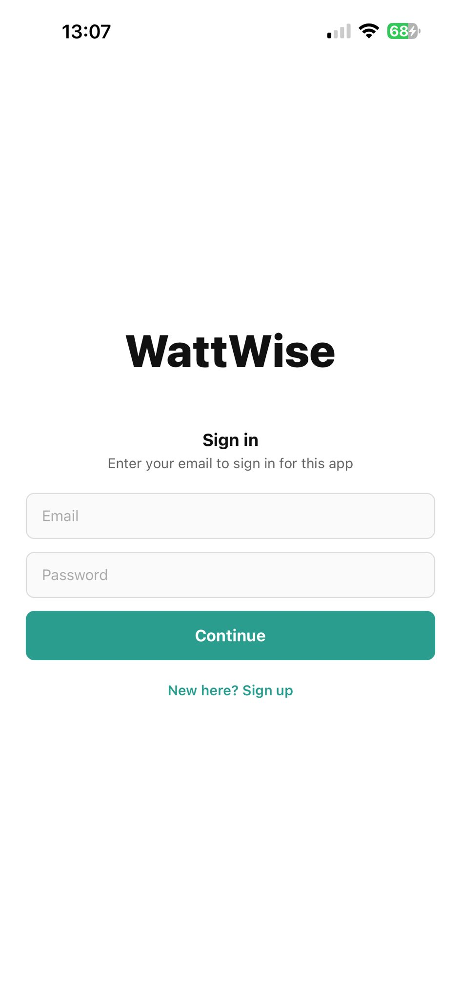
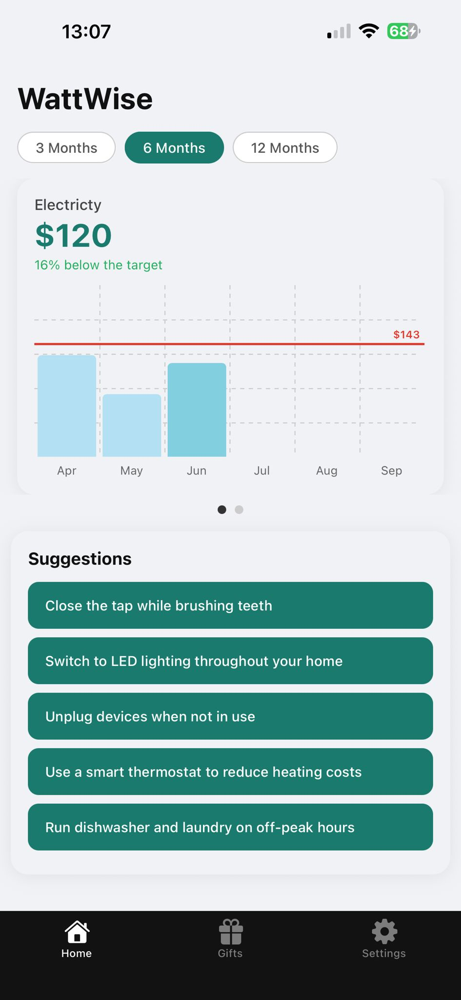
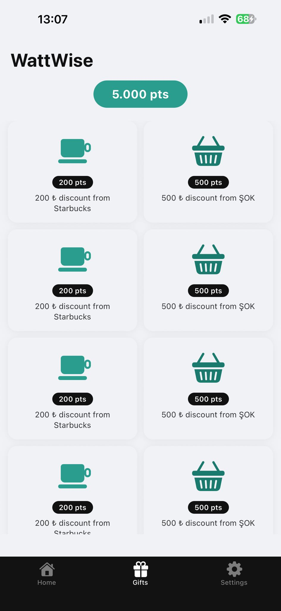
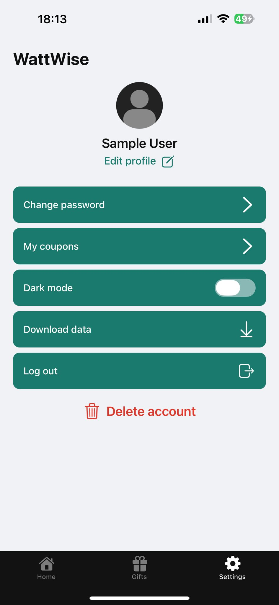

# WattWise App

This is an [Expo](https://expo.dev) created for BLG-442E lecture as a group project.

## What is WattWise?

This is a sample electricity and water expense tracker app.

<div style="{display: flex; flex:1; flex-direction: row}">
      
      
      
      
</div>

Properties:

- Login/Signup forms
- Interactive Dashboard and Gifts
- Account management

## Get started

1. Install dependencies

   ```bash
   npm install
   ```

2. Start the app

   ```bash
   npx expo start
   ```

In the output, you'll find options to open the app in a

- [development build](https://docs.expo.dev/develop/development-builds/introduction/)
- [Android emulator](https://docs.expo.dev/workflow/android-studio-emulator/)
- [iOS simulator](https://docs.expo.dev/workflow/ios-simulator/)
- [Expo Go](https://expo.dev/go), a limited sandbox for trying out app development with Expo
